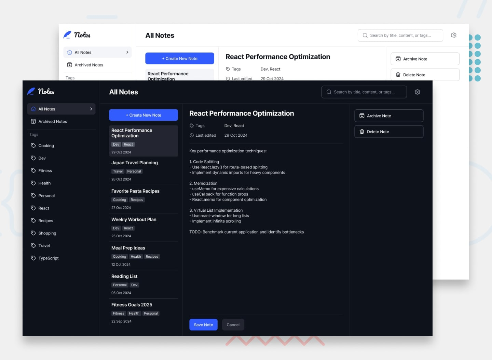

# 📝 Note-Taking Web App (Full-Stack, Local-First, Pixel-Perfect)

A modern, high-performance, pixel-perfect note-taking web application built according to the official **Frontend Mentor** challenge and **Figma design system**. Built with **React 19, TypeScript, Vite, Tailwind CSS v4, Supabase (BaaS)**, and designed for multi-platform access (**Web, PWA for Desktop/Mobile, and Chrome Extension**).



---

## 🚀 Key Highlights & Architectural Features

### 🎨 1. Pixel-Perfect Figma Implementation
- **Exact Token Mapping**: Strict adherence to official colors (Neutral 50–950, Primary Blue, Success Green, Destructive Red) and typography scales.
- **Dynamic Themes**:
  - **Color Themes**: Light Mode, Dark Mode, and System Theme.
  - **Font Themes**: Sans-serif (`Inter`), Serif (`Noto Serif`), and Monospace (`Source Code Pro`).
- **Fully Responsive**: Tailored layouts for Desktop (3-column layout), Tablet (collapsible drawers), and Mobile (adaptive screens).

### ⚡ 2. Local-First Architecture & Cloud Sync (Supabase)
- **Zero-Latency Editing**: All note edits, tags, pins, and state changes persist instantly into `localStorage` / offline cache.
- **Silent Background Sync**: When authenticated and connected to the internet, notes automatically sync with **Supabase (PostgreSQL)**.
- **Row-Level Security (RLS)**: Bank-grade database access control guarantees users only see and manage their own notes.
- **1-Click Demo / Guest Mode**: Try the entire app immediately without creating an account or needing API keys.

### 📱 3. Multi-Platform & PWA Ready
- **Desktop & Mobile App (PWA)**: Install directly from Chrome, Edge, or Safari with offline caching via Service Worker.
- **Chrome Extension Companion (`/extension`)**: Includes a Manifest V3 popup extension to clip notes and web URLs straight into your Notes database.

### ✍️ 4. Rich Formatting & Markdown Editor
- **WYSIWYG & Markdown**: Bold, Italic, Strikethrough, Headings (H1/H2/H3), Bullet Lists, Numbered Lists, Task Checklists, Blockquotes, and Code Blocks.
- **Live Markdown Preview**: Toggle between raw markdown and beautifully rendered rich text.
- **Live Note Statistics**: Real-time word count, character count, and estimated reading time.
- **Multi-Format Exporter**:
  - 📄 **Markdown (`.md`)** with frontmatter metadata
  - 📝 **Plain Text (`.txt`)**
  - 📊 **JSON Data (`.json`)** full backup
  - 🖨️ **PDF / Print** clean document layout

### ⌨️ 5. Keyboard Navigation & Command Palette
- **Command Palette (`Ctrl+K` / `Cmd+K`)**: Fast universal search, action execution, and navigation without touching the mouse.
- **Keyboard Shortcuts**:
  - `Ctrl + K` / `Cmd + K`: Open Command Palette
  - `Ctrl + S` / `Cmd + S`: Save active note
  - `Alt + N`: Start a new note
  - `Escape`: Close modals and search

### 🗑️ 6. Trash Recovery System & Pinned Notes
- **Soft Delete**: Notes moved to Trash can be restored anytime before being permanently emptied.
- **Pin to Top**: Keep critical notes anchored at the top of your list.

---

## 🛠️ Tech Stack

| Layer | Technology |
|---|---|
| **Frontend Framework** | React 19 + TypeScript |
| **Bundler & Build Tool** | Vite 8 + Rolldown |
| **Styling** | Tailwind CSS v4 |
| **Database & BaaS** | Supabase (PostgreSQL + Auth + RLS) |
| **PWA & Offline** | Service Worker API + Web App Manifest |
| **Companion Extension** | Chrome Manifest V3 |
| **Hosting & Deployment** | Cloudflare Pages / Vercel |

---

## 📂 Project Structure

```
note-taking-web-app/
├── extension/                  # Chrome Extension Manifest V3 companion
│   ├── manifest.json
│   ├── popup.html
│   └── popup.js
├── public/
│   ├── assets/                 # Official SVGs & fonts
│   ├── manifest.json           # PWA Web App Manifest
│   ├── service-worker.js       # Offline service worker
│   └── _redirects              # Cloudflare Pages SPA rewrite rules
├── src/
│   ├── assets/                 # SVGs and fonts
│   ├── components/
│   │   ├── Auth/               # Login, Signup, Password Reset modals
│   │   ├── Editor/             # NoteEditor, Toolbar, MarkdownRenderer
│   │   ├── Modals/             # DeleteModal, ArchiveModal, SettingsModal
│   │   ├── CommandPalette.tsx  # Ctrl+K command menu
│   │   ├── Header.tsx          # Top navigation & search bar
│   │   ├── NoteCard.tsx        # Note item card
│   │   ├── NoteList.tsx        # Middle note list column
│   │   ├── Sidebar.tsx         # Left navigation & tags list
│   │   └── Toast.tsx           # Toast notification system
│   ├── context/
│   │   ├── AuthContext.tsx     # Supabase Auth + Guest Mode
│   │   ├── NotesContext.tsx    # CRUD, search, filter, cloud sync
│   │   └── ThemeContext.tsx    # Light/Dark and Font theme switching
│   ├── services/
│   │   └── supabase.ts         # Supabase client & database API
│   ├── styles/
│   │   └── globals.css         # Tailwind v4 theme tokens
│   ├── types/
│   │   └── note.ts             # TypeScript interfaces
│   ├── utils/
│   │   ├── formatters.ts       # Dates, word stats, and multi-format exporters
│   │   └── initialData.ts      # 10 starter notes from Frontend Mentor
│   ├── App.tsx                 # Root responsive layout
│   └── main.tsx                # Entry point
├── supabase-schema.sql         # Ready-to-run PostgreSQL table & RLS script
├── index.html
├── package.json
├── tsconfig.json
└── vite.config.ts
```

---

## ⚡ Getting Started Locally

### 1. Clone & Install
```bash
git clone https://github.com/your-username/note-taking-web-app.git
cd note-taking-web-app
npm install
```

### 2. Run Development Server
```bash
npm run dev
```
Open [http://localhost:5173](http://localhost:5173) in your browser.

### 3. (Optional) Connect Supabase for Cloud Sync
The app works out of the box in **Demo / Local-First Mode**. To connect your own cloud database:
1. Create a free project at [Supabase](https://supabase.com).
2. Go to **SQL Editor** in Supabase and run the queries in [`supabase-schema.sql`](./supabase-schema.sql).
3. Copy `.env.example` to `.env`:
   ```bash
   cp .env.example .env
   ```
4. Fill in your project URL and Anon Key:
   ```env
   VITE_SUPABASE_URL=https://your-project.supabase.co
   VITE_SUPABASE_ANON_KEY=your-anon-key
   ```
5. Restart your development server.

---

## 🌐 Cloudflare Pages Deployment

This project is fully configured for zero-configuration deployment on **Cloudflare Pages**:

1. Push your code to GitHub.
2. In Cloudflare Dashboard, navigate to **Compute (Workers & Pages)** > **Create application** > **Pages** > **Connect to Git**.
3. Select this repository and configure build settings:
   - **Framework preset**: `Vite` (or None)
   - **Build command**: `npm run build`
   - **Build output directory**: `dist`
4. In **Environment variables**, optionally add:
   - `VITE_SUPABASE_URL`
   - `VITE_SUPABASE_ANON_KEY`
5. Click **Save and Deploy**.

*(The included `public/_redirects` ensures that SPA page reloads never throw 404 errors).*

---

## 🧩 Installing the Chrome Extension Companion

1. Open Google Chrome and visit `chrome://extensions`.
2. Toggle **Developer mode** in the top right.
3. Click **Load unpacked** and select the `extension/` directory inside this repository.
4. Click the Notes icon in your toolbar to instantly capture snippets, URLs, and notes!

---

## ⌨️ Keyboard Shortcuts Cheat Sheet

| Shortcut | Action |
|---|---|
| `Ctrl + K` / `Cmd + K` | Open Command Palette |
| `Ctrl + S` / `Cmd + S` | Save current note |
| `Alt + N` | Create new note |
| `Escape` | Close active modal or menu |

---

## 🏆 Challenge Compliance Checklist

- [x] Create, read, update, and delete notes
- [x] Archive and restore notes
- [x] Filter by tags and custom tag creation
- [x] Real-time search by title, content, or tags
- [x] Color theme switcher (Light, Dark, System)
- [x] Font theme switcher (Sans-serif, Serif, Monospace)
- [x] Form validation and error states for authentication
- [x] Full keyboard navigation & shortcut support
- [x] Responsive layout (Desktop, Tablet, Mobile)
- [x] Hover and focus states across all interactive elements
- [x] **Bonus**: Full-Stack database integration (Supabase PostgreSQL + RLS)
- [x] **Bonus**: User authentication (Sign up, Log in, Logout, Change Password)
- [x] **Bonus**: Password reset capabilities
- [x] **Bonus**: Rich WYSIWYG & Markdown editor with live preview
- [x] **Bonus**: Multi-format export (Markdown, TXT, PDF, JSON)
- [x] **Bonus**: PWA for desktop & mobile installation
- [x] **Bonus**: Chrome Extension companion

---

## 📄 License
This project is open-source and available under the [MIT License](LICENSE).
