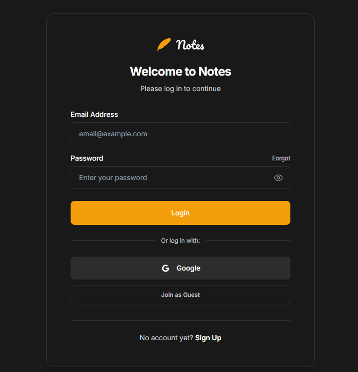
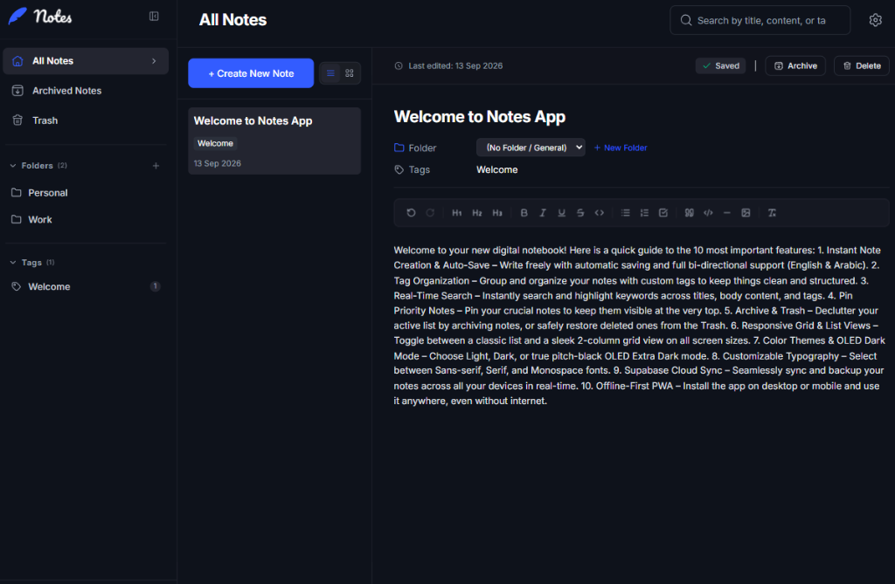
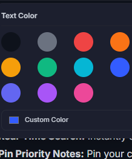
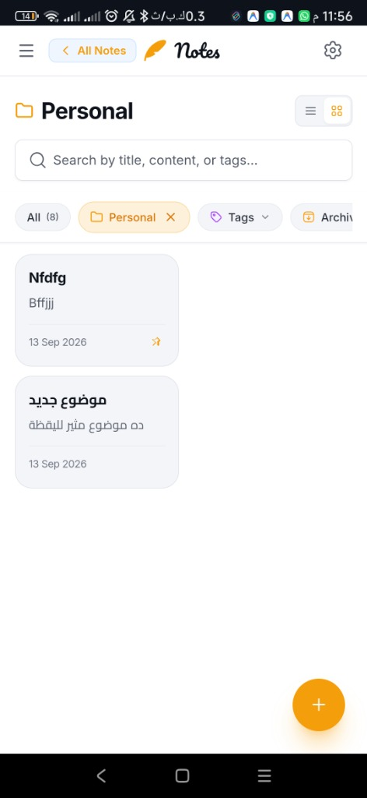
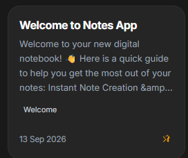
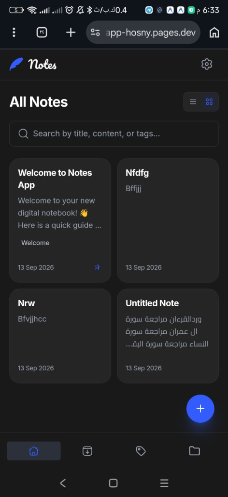

# 📝 Pretty Notes - Complete Features Guide & Showcase
### Welcome to your modern, blazing-fast digital notebook! 🚀✨

👉 **[اضغط هنا لقراءة الدليل بالعامية المصرية / Switch to Egyptian Arabic Version 🇪🇬](./العربي.md)**

---

> 🌐 **Live Web Application**: [https://pretty-notes-app.pages.dev](https://pretty-notes-app.pages.dev)  
> 💡 **Tech Stack**: React 19, Vite, Tailwind CSS v4, TipTap Rich Text, Supabase, Brevo SMTP, Cloudflare Pages.

Designed for speed, clarity, and delight, **Pretty Notes** blends a lightweight local-first architecture with cloud synchronization, keyboard-driven productivity, and thoughtful micro-interactions inspired by the best mobile and desktop note apps.

---

## 1. 🚀 Instant Frictionless Access: Guest Mode & Cloud Sync
No tedious mandatory registration just to jot down a quick idea.

* **One-Click "Join as Guest"**: Launch directly into the workspace with zero delay. All data is saved securely into browser storage (Local-First).
* **Supabase Cloud Sync**: Create an account anytime to seamlessly sync notes across mobile devices, tablets, and desktops with PostgreSQL Row-Level Security (RLS).
* **Branded Brevo SMTP Deliverability**: Direct inbox delivery for verification emails and password reset links with no spam drops.
* **Automated Password Reset Flow**: Clicking the recovery email link automatically intercepts the token and presents the "Reset Password" modal cleanly.

---

## 2. ✍️ Full-Featured TipTap Rich Text Editor
A distraction-free writing experience equipped with powerful formatting capabilities:

### Editor Highlights:
* **Typography & Structure**:
  - Headings: `H1`, `H2`, and `H3` with clean visual scale.
  - Text Styles: **Bold** (`Ctrl+B`), *Italic* (`Ctrl+I`), <u>Underline</u> (`Ctrl+U`), ~~Strikethrough~~, `Inline Code`.
  - Content Blocks: Blockquotes and styled Code Blocks with syntax monospace fonts.
* **Interactive Checklists (To-Do Lists)**: Checkable items with automated strikethrough for task tracking.
* **Curated Color Palette**:
  
  
  
  - 11 hand-picked colors optimized for readability in both light and dark themes.
  - Native custom HEX color picker for exact shade customization.
* **Drag-and-Drop & Clipboard Image Insertion**:
  - Insert images via file upload, image URL, or direct clipboard pasting (`Ctrl+V` / `Cmd+V`).
* **Real-Time Auto-Save with Visual Feedback**:
  - Zero worry about losing unsaved changes; status badges indicate `Saving...` and `Saved` in real time.
* **Bilingual Arabic (RTL) & English (LTR) Support**: Natural text direction detection and tailored typography for comfortable reading.

---

## 3. 🗂️ Intuitive Organization: Folders, Tags & Pinned Items
Keep your thoughts categorized without friction:

* **Custom Folders**: Organize notes into custom folders (e.g., Personal, Work, Ideas). Easily create, rename, and delete folders.
* **Curved Chevron Back Button**:
  - A clean, modern `rounded-xl` back button positioned right next to the folder title.
  - Seamlessly integrated with browser navigation history and mobile swipe-back gestures.
* **Multi-Tagging System**: Add hashtags (`#work`, `#ideas`) to any note with automatic tag badges and one-click filtering.
* **Pinned Notes & Sticky Quick-Filters**:
  
  
  
  - Pin important notes to anchor them firmly at the top of the list with an amber pin icon.
  - Pin favorite folders and tags directly into the sticky action bar for single-tap navigation.
* **Archive & Safe Trash Management**:
  - Archive completed notes to keep your active list clutter-free.
  - Soft-delete to Trash with instant restore capability, plus an empty trash confirmation safeguard.

---

## 4. ⚡ Multi-Select & Floating Action Dock
Perform batch actions across dozens of notes in seconds:

* **Activation**:
  - **Mobile**: Long-press (~450ms with subtle haptic vibration feedback) on any note card, or tap the Select toggle.
  - **Desktop**: Click the `[☑ Select]` button in the top navigation header.
* **Floating Action Dock**:
  - An animated bottom bar appears with live count (`X of Y selected`) and quick-access actions:
    1. 🏷️ **Bulk Tag**: Apply tags across all selected notes simultaneously.
    2. 📁 **Bulk Move**: Relocate selected notes to any folder in a single click.
    3. 📦 **Bulk Archive / Unarchive**: Mass archive or restore notes.
    4. 💾 **Bulk Export**: Download selected notes as JSON, Markdown (`.md`), Plain Text (`.txt`), or a compressed `.zip` archive.
    5. 🗑️ **Bulk Delete**: Safely send all selected notes to Trash.

---

## 5. 📱 Layout Innovation & Mobile-First UX
Engineered for smooth, native-like interactions on every screen:

* **Balanced 2-Column Responsive CSS Grid**:
  - Clean side-by-side note cards on mobile without awkward single-column vertical stretches.
  - Card footers align systematically using `mt-auto` for a polished, uniform look.
* **Smooth Collapsible Header (Apple Notes Feel)**:
  - Header and search input smoothly glide up and tuck under on scroll.
  - Action chips bar locks into a sleek sticky frosted-glass header (`backdrop-blur`) with **0% layout shift, 0% container resizing, and 0% jitter**.
* **Bottom Navigation Bar on Mobile**: Ergonomic one-thumb navigation tabs for Home, Archive, Tags, and Folders.
* **Floating Action Button (FAB)**: Quick-launch note creation button with smooth press animations.

---

## 6. 🎨 Customization, Themes & Typography
Personalize the app to suit your working style:

* **Theme Modes**:
  - **Light Mode**: Crisp, high-contrast daylight reading.
  - **Dark Mode**: Soft low-light dark theme.
  - **OLED Extra Dark**: Deep pitch-black background for battery saving and zero screen glare.
* **Accent Color Themes**: Pick your favorite accent hue (Amber, Blue, Purple, Green, etc.) applied dynamically across buttons, chips, and highlights.
* **Typography Switching**: Choose between Sans-serif (clean & modern), Serif (editorial & classic), or Monospace (code-focused).

---

## 7. 📲 Progressive Web App (PWA) - Pretty Notes
* Fully installable on iOS, Android, macOS, and Windows under the name **Pretty Notes**.
* Runs in standalone window mode without browser URL bars.
* Instant offline cache support for uninterrupted productivity anywhere.

---

👉 **[اضغط هنا لقراءة النسخة بالعامية المصرية / Read Egyptian Arabic Version 🇪🇬](./العربي.md)**

