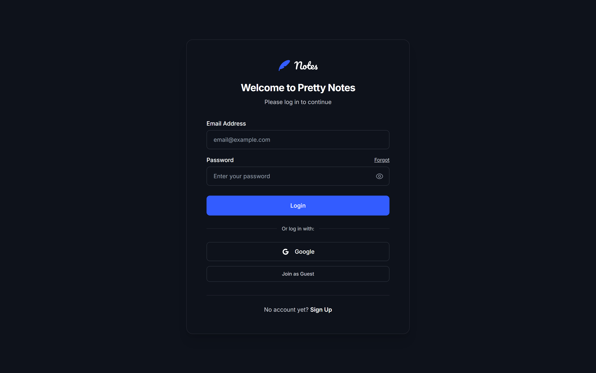
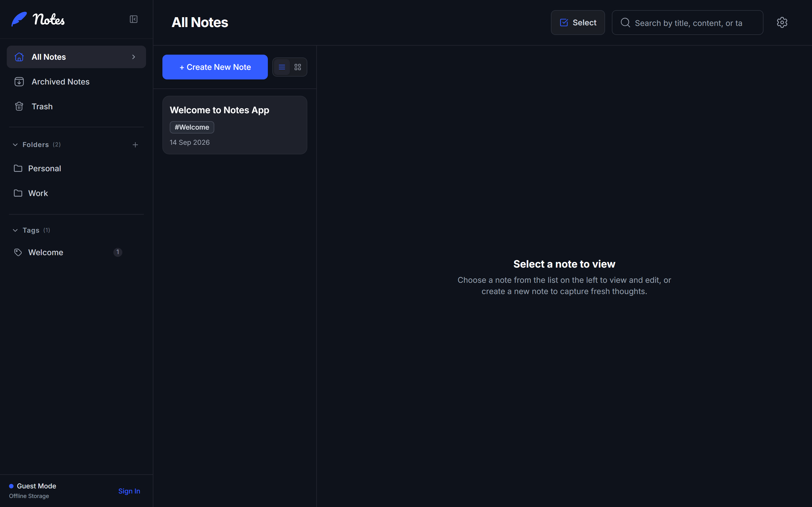
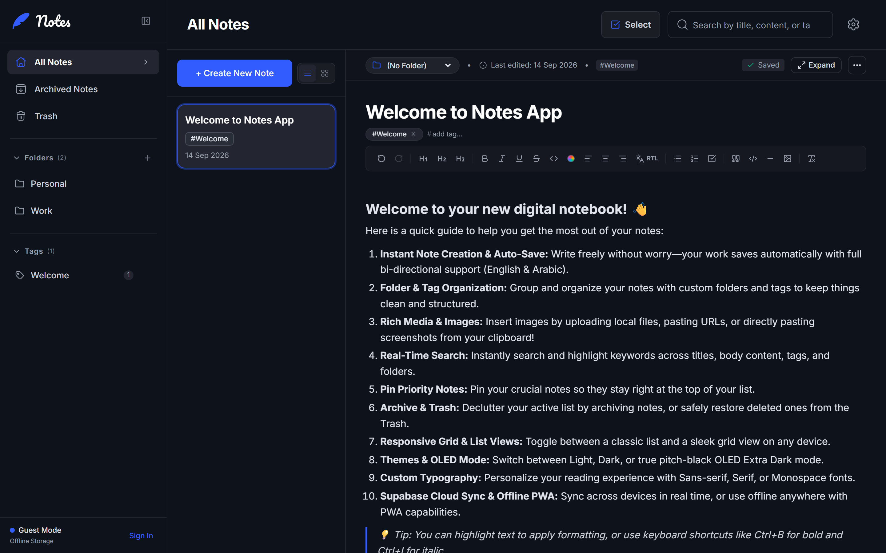
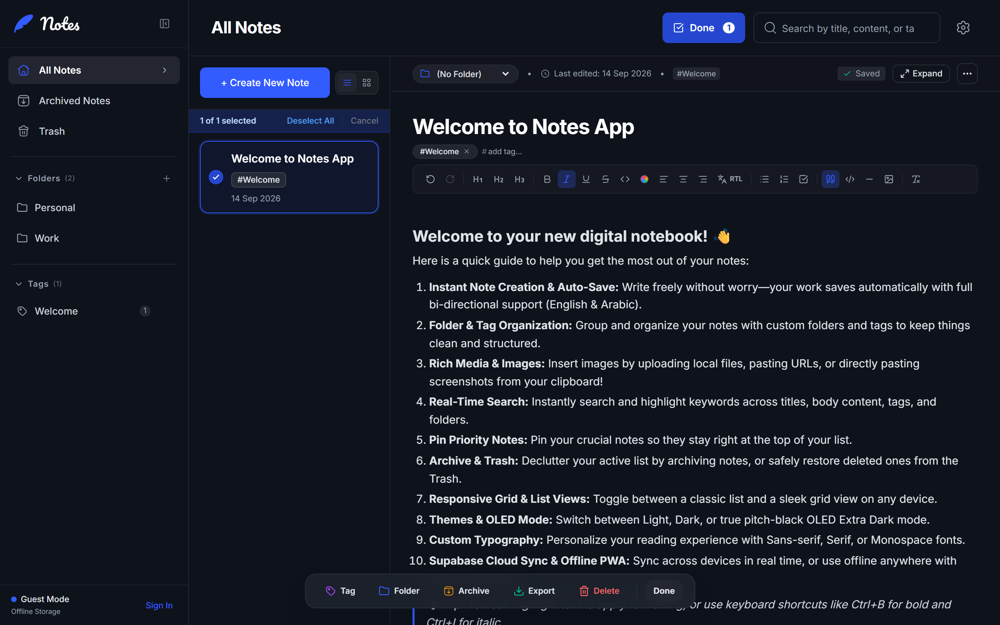
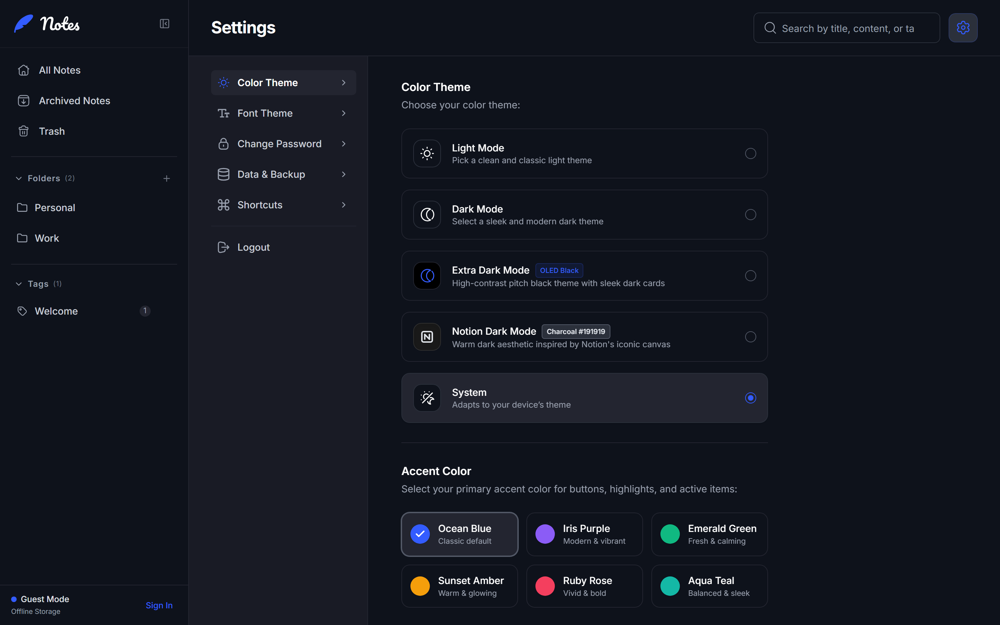
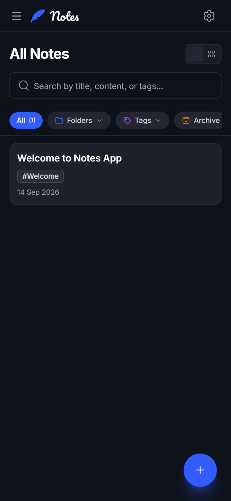
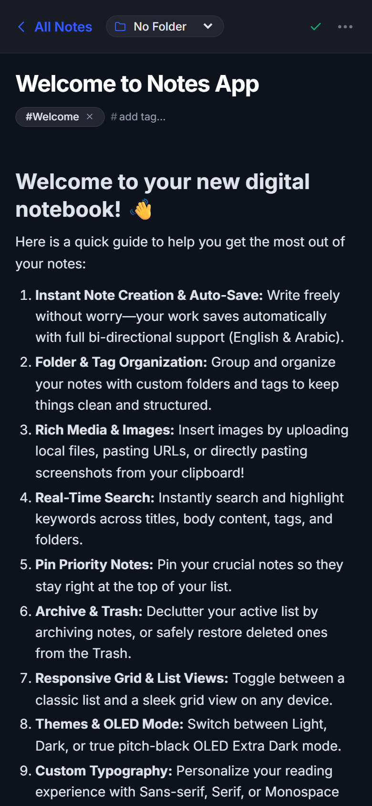
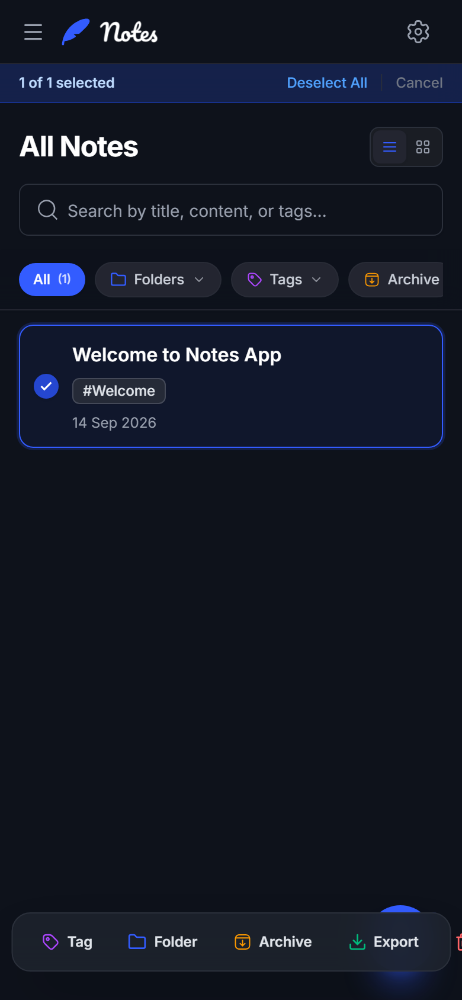

# 📝 Pretty Notes App - الدليل الشامل وتجربة الاستخدام
### كل المميزات اللي نفذناها في التطبيق بالشرح والصور 🚀✨

👉 **[اضغط هنا لقراءة الدليل باللغة الإنجليزية / Switch to English Version 🇬🇧](./ENGLISH.md)**

---

> 🌐 **رابط التطبيق المباشر (Production)**: [https://pretty-notes-app.pages.dev](https://pretty-notes-app.pages.dev)  
> 💡 **التقنيات المستخدمة**: React 19, TypeScript, Vite, Tailwind CSS v4, TipTap Rich Text, Supabase PostgreSQL, Brevo SMTP, Cloudflare Pages.

التطبيق ده اتبنى من الصفر ليكون تطبيق ملاحظات متكامل، فائق السرعة، بيجمع بين تجربة التخزين المحلي الفوري (**Local-First**) والمزامنة السحابية الذكية مع **Supabase**، وتجربة كتابة راقية تضاهي تطبيقات Notion و Apple Notes.

---

## 1. 🚀 البداية الفورية: تجربة الزائر (Guest Mode) وحساب السحابة
مش محتاج تسجل عشان تجرب التطبيق! بضغطة زر واحدة كل حاجة جاهزة:

* **زرار "Join as Guest" السريع**: ادخل فوراً على التطبيق بدون كتابة إيميل أو باسورد. كل ملاحظاتك بتتخزن محلياً في جهازك (Local-First) وتفضل محفوظة حتى لو قفلت المتصفح.
* **حساب سحابي مربوط بقاعدة بيانات Supabase**: سجل بإيميلك الشخصي لمزامنة ملاحظاتك تلقائياً وبشكل مشفر عبر كل أجهزتك (كمبيوتر، تابلت، موبايل) مع حماية كاملة بنظام **Row-Level Security (RLS)**.
* **إيميلات تفعيل سريعة واحترافية عبر Brevo SMTP**: تم ربط التطبيق بسيرفرات Brevo SMTP المخصصة، فرسائل تأكيد الإيميل وكود الاسترجاع بتوصلك فوراً للـ Inbox بدون أي مشاكل Spam.
* **استرجاع كلمة السر الذاتي (Password Recovery)**: بمجرد ما تدوس على اللينك اللي بيوصلك في الإيميل، التطبيق بيتعرف تلقائياً على رمز الاسترجاع ويفتحلك نافذة كتابة الباسورد الجديد مباشرة.

---

## 2. 💻 واجهة الكمبيوتر المتكاملة (Desktop Workspace)
تصميم احترافي مريح ومقسم بعناية لزيادة الإنتاجية:

* **شريط جانبي متكامل (Sidebar)**:
  - كل الملاحظات (All Notes).
  - الأرشيف (Archived Notes).
  - سلة المهملات الآمنة (Trash).
  - قسم المجلدات (Folders) مع إمكانية إنشاء مجلدات وتسميتها وحذفها.
  - قسم التاجات (Tags) مع عداد الملاحظات لكل تاج وتثبيت التاجات المهمة.
* **زر التحديد السريع `[☑ Select]`**: موجود في الهيدر العلوي لتفعيل وضع التحديد المتعدد بضغطة واحدة.
* **شريط بحث فوري**: يبحث لحظياً في كل العناوين ومحتوى الملاحظات والتاجات.

---

## 3. ✍️ محرر النصوص الذكي (TipTap Rich Text Engine)
محرر قوي يمنحك حرية كاملة في تنسيق أفكارك:

* **تنسيقات النصوص والعناوين الكاملة**:
  - عناوين بأحجام متدرجة: `H1` للمواضيع، `H2` للأقسام، و `H3` للنقاط الفرعية.
  - تنسيقات بصرية سريعة وبالكيبورد: عريض (**Bold** باختصار `Ctrl+B`)، مائل (*Italic* باختصار `Ctrl+I`)، تحته خط (<u>Underline</u> باختصار `Ctrl+U`)، ومشطوب (~~Strikethrough~~).
  - أكواد برمجية: كود مدمج (`Inline Code`) وبلوك برمجي مخصص للأكواد (`Code Block`).
* **قوائم مهام تفاعلية (To-Do Checklists)**: checkboxes تفاعلية تضع خط شطب على المهام المنجزة.
* **اقتباسات وفواصل**: بلوك اقتباسات راقي وفواصل أفقية لتقسيم المقال.
* **بالتة ألوان مخصصة للنصوص**: 11 لون جاهز للقراءة المريحة مع منتقي ألوان كامل (HEX Custom Color).
* **إدراج الصور**: ارفع صورة من جهازك، أو الصق رابط صورة، أو اعمل لصق فوري من الحافظة (`Ctrl + V`).
* **حفظ تلقائي فوري ومؤشر حالة**: مؤشر أخضر `Saved` لحفظ أي تعديل لحظياً بدون فقدان أي بيانات.
* **دعم ممتاز للعربية (RTL)**: ضبط تلقائي لمحاذاة النص واتجاه الكتابة لراحة القارئ العربي.

---

## 4. ⚡ التحديد الجماعي والبار العائم (Multi-Select & Bulk Action Dock)
إنجاز العمليات الكبيرة على عشرات الملاحظات في ثوانٍ معدودة:

* **طريقة التفعيل**:
  - على الكمبيوتر: اضغط على زرار `[☑ Select]` في الهيدر.
  - على الموبايل: اضغط ضغطة مطولة (Long Press لمدة ~450ms مع هزة فايبريشن) على أي كارت ملاحظة.
* **البار العائم الذكي (Floating Bulk Dock)**:
  1. 🏷️ **Bulk Tag**: إضافة تاجات لمجموعة ملاحظات بضغطة واحدة.
  2. 📁 **Bulk Move**: نقل الملاحظات المحددة لمجلد محدد فوراً.
  3. 📦 **Bulk Archive**: أرشفة أو إلغاء أرشفة مجموعة ملاحظات دفعة واحدة.
  4. 💾 **Bulk Export**: تصدير وتنزيل الملاحظات بصيغ (Markdown `.md`, Text `.txt`, JSON, أو ملف مضغوط `.zip`).
  5. 🗑️ **Bulk Delete**: نقل كل الملاحظات المحددة لسلة المهملات بأمان.

---

## 5. 🎨 التخصيص والثيمات ووضع الـ OLED (Settings & Themes)
تحكم كامل في مظهر التطبيق لراحة عينك:

* **أوضاع العرض (Theme Modes)**:
  - **Light Mode**: وضع نهاري ناصع ومريح في الإضاءة العالية.
  - **Dark Mode**: وضع ليلي عصري وناعم.
  - **Extra Dark Mode (OLED Black)**: خلفية سوداء نقية توفر بطارية شاشات الـ OLED وتمنع إجهاد العين.
  - **Notion Dark Mode**: مستوحى من درجات ألوان نوشن الفاخرة (`#191919`).
  - **System**: يتكيف تلقائياً مع وضع جهازك.
* **ألوان الهوية (Accent Colors)**:
  - أزرق محيطي (Ocean Blue)، بنفسجي هادئ (Iris Purple)، أخضر زمردي (Emerald Green)، عنبري ذهبي (Sunset Amber)، وردي جذاب (Ruby Rose)، وتركواز أنيق (Aqua Teal).
* **أنواع الخطوط (Typography)**:
  - **Sans-serif**: خط عصري نظيف (`Inter`).
  - **Serif**: خط كلاسيكي فاخر للقراءة الطويلة (`Noto Serif`).
  - **Monospace**: خط المطورين المخصص للأكواد (`Source Code Pro`).

---

## 6. 📱 تجربة الموبايل وشبكة العرض المتوازنة (Mobile-First UX)
تم بناء واجهة الموبايل من الصفر لتكون خفيفة وسلسة:

* **شبكة الكروت المتوازنة (Balanced 2-Column Grid)**:
  - ترتيب أنيق للملاحظات في عمودين متجاورين دون فراغات عشوائية.
  - تذييل الكروت (`mt-auto`) مظبوط بحيث التاجات والتواريخ تصطف أفقياً بشكل منظم.
* **هيدر أبل الانسيابي (Apple Notes Sticky Header)**:
  - عند التمرير لأسفل، يختفي العنوان والبحث بنعومة فائقة، ويثبت شريط الفلاتر في القمة مع خلفية زجاجية مضببة (`backdrop-blur`) وبدون أي اهتزاز (`0% Jitter`).
* **شريط التنقل السفلي والزر العائم (FAB)**:
  - وصول سريع بلمسة إبهام لأقسام الرئيسية، الأرشيف، التاجات، والمجلدات، وزرار دائري عائم (`+`) لتدوين الأفكار فوراً.

---

## 7. 📲 محرر الموبايل والتنقل الذكي داخل المجلدات
تجربة كتابة وتنقل فائقة السلاسة على الهواتف:

| محرر الموبايل الذكي | التحديد الجماعي على الموبايل |
| :---: | :---: |
|  |  |

* **زر الرجوع المنحني الأنيق (Curved Chevron Back Button)**:
  - بوكس دائري منحني ناعم (`rounded-xl`) موجود جنب اسم المجلد أو التاج من الشمال، متوافق مع إيماءات الرجوع وزرار المتصفح.
* **تسنتر الإشعارات (Centered Toast Notifications)**:
  - الإشعارات ورسائل التأكيد تظهر الآن مسنترة تماماً في منتصف شاشات الموبايل والتابلت (`left-1/2 -translate-x-1/2`)، ومرتفعة بأمان عن زرار الـ FAB والشريط السفلي.
* **تطبيق ويب تقدمي (PWA)**:
  - يمكن تثبيت التطبيق مباشرة على شاشة الهاتف باسم **Pretty Notes** ويعمل بدون نت كأنه تطبيق أصلي.

---

👉 **[اضغط هنا لقراءة النسخة الإنجليزية / Read the English Version 🇬🇧](./ENGLISH.md)**

